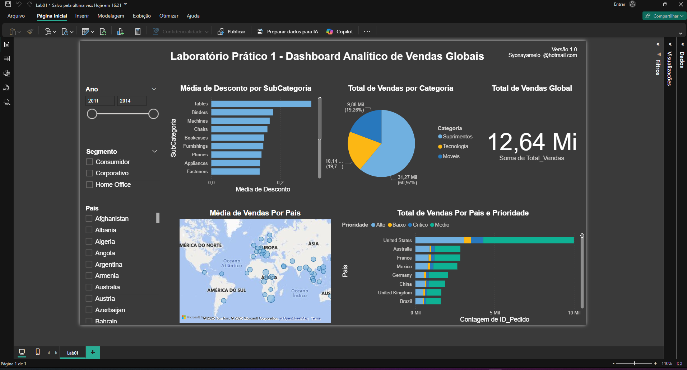

# 📊 Laboratório Prático 1 - Dashboard Analítico de Vendas Globais

Este projeto faz parte do **Laboratório Prático 1** do curso de Power BI, com foco na criação de um **Dashboard Analítico** para responder perguntas de negócio relacionadas a vendas globais.

---

## 🎯 Objetivo
Construir um dashboard interativo no Power BI capaz de responder perguntas-chave sobre as vendas, permitindo ao usuário explorar os dados por diferentes filtros e perspectivas.

---

## 📝 Perguntas de Negócio

1. **Qual o valor total vendido?**
2. **Quantas vendas foram realizadas por categoria de produto?**
3. **Quantas vendas foram realizadas por país considerando a prioridade de entrega?**
4. **Qual foi a média de desconto nas vendas por subcategoria de produto?**
5. **Quais países tiveram maior média de valor de venda?** (Representação em mapa)

---

## 🛠️ Funcionalidades do Dashboard
- Filtros interativos por:
  - **Ano**
  - **Segmento**
  - **País**
- Indicadores visuais (KPI) para valor total vendido.
- Gráficos por categoria e subcategoria de produto.
- Mapa interativo para análise geográfica de vendas.
- Visualização de métricas por prioridade de entrega.

---

## 📂 Estrutura do Repositório
- `Lab01.pbix` → Arquivo do dashboard no Power BI Desktop.
- `15-dataset/dataset.xlsx` → Planilha com os dados de vendas.
- `15-dataset/dataset.csv` → Versão CSV dos dados para compatibilidade.
- `img/dashboard.png` → Imagem de prévia do dashboard.
- `README.md` → Documentação do projeto.

---

## 🖼️ Prévia do Dashboard

---

## 🚀 Como Utilizar
1. Baixe o arquivo `.pbix` e o dataset.
2. Abra no **Power BI Desktop**.
3. Explore os gráficos e utilize os filtros para interagir com os dados.

---

## 📌 Observações
- Os dados são fictícios e utilizados apenas para fins acadêmicos.
- Este projeto foi desenvolvido como exercício prático para aplicar conceitos de **Business Intelligence** e **visualização de dados**.

---
